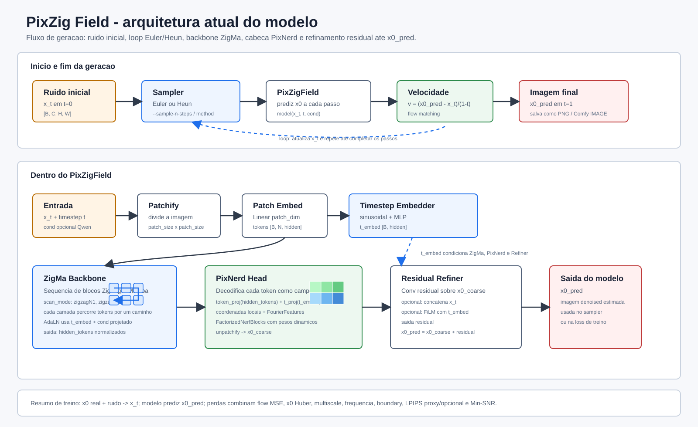
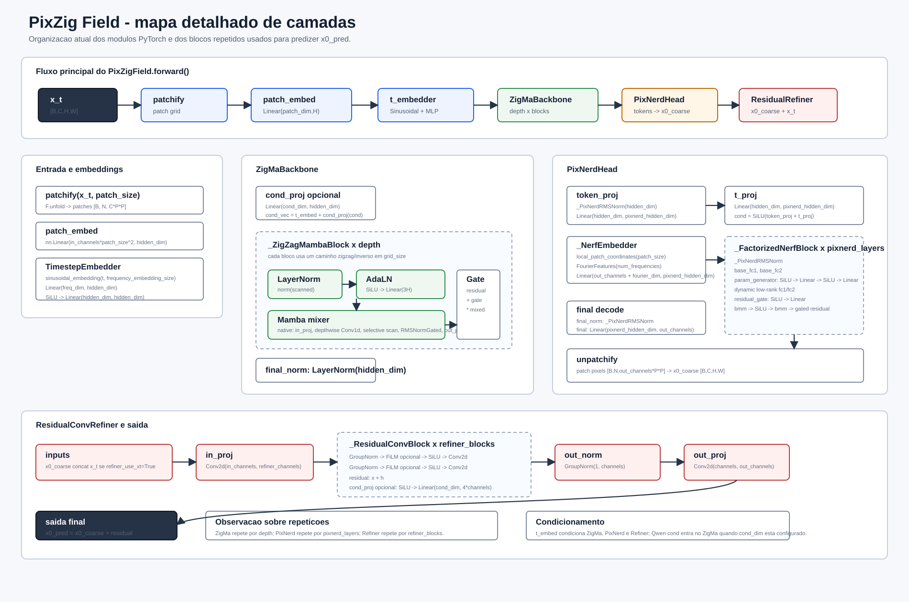

# PixZig Field

PixZig Field is a PyTorch image-generation model that combines a ZigMa-style
spatial backbone with a PixNerd-inspired neural field decoder. The model works
directly in image space and predicts `x0`, using flow-matching utilities for
sampling.

The project is built around three main ideas:

- **ZigMa backbone**: patch tokens are processed through zigzag spatial scan
  paths with a native selective Mamba-style sequence mixer.
- **PixNerd decoder**: image patches are reconstructed with local Fourier
  features and dynamic per-patch neural field layers.
- **Residual refiner**: a lightweight convolutional refiner improves the final
  image prediction using timestep conditioning and optional input-state
  conditioning.

## Architecture

<p align="center">
  
</p>

```text
x_t, timestep, optional text conditioning
-> patchify
-> patch embedding
-> timestep embedding
-> ZigMaBackbone
-> selective Mamba-style blocks over zigzag paths
-> PixNerdHead dynamic neural field decoder
-> coarse x0 prediction
-> ResidualConvRefiner
-> final x0 prediction
```

<p align="center">
  
</p>

## Main Modules

```text
pixzig_field/
  model.py         # PixZigField model wrapper
  zigma.py         # ZigMa backbone and scan logic
  pixnerd_head.py  # PixNerd-style neural field decoder
  refiner.py       # residual convolutional image refiner
  patch.py         # patchify and unpatchify helpers
  timestep.py      # timestep embeddings
  fourier.py       # local Fourier features
  film_adaln.py    # FiLM and AdaLN conditioning layers
  flow_matching.py # x0 and velocity conversion utilities
  sample.py        # Euler and Heun sampling
  text_encoder.py  # optional Qwen text conditioning wrapper
  checkpoint.py    # checkpoint and safetensors helpers
  config.py        # model and runtime configuration dataclasses

nodes.py           # ComfyUI custom node entrypoint
```

## ComfyUI

PixZig Field includes a ComfyUI custom node entrypoint at the project root:

```text
nodes.py
```

Available nodes:

- `Load PixZig Field`
- `Load PixZig Qwen`
- `PixZig Encode Prompt`
- `PixZig Sampler`

The sampler returns a ComfyUI `IMAGE` tensor and supports live preview updates
during generation.

## References

https://github.com/MCG-NJU/PixNerd

https://github.com/CompVis/zigma

https://github.com/state-spaces/mamba
